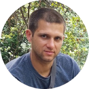

# Hi, I'm Vycheslav Gavrish 👋

   
   

   

   📫 How to reach me: <a href='mailto:slava.gvsh@gmail.com'>slava.gvsh@gmail.com</a>

    How to reach me: +38 (066) 938-00-74 (Viber, WhatsApp)

   Nickname on the rs school discord server: Slava.gvsh#7729

## About me:
I started learning HTML/CSS hard six months ago. I really like it and now I want to improve my JavaScript skills. By signing up for courses at the RS School, I plan to improve my teamwork skills and learn new knowledge in the field of IT. In my free time I like to go in for sports (jogging, playing basketball), I really like fishing, camping.
## Experience:
* Freelance (6 month) 
* layout of landing pages, adaptive layouts. 

## Skills:
* HTML5, CSS3, SCSS;
* Flex, Bootstrap;
* BEM;
* Git & GitHub;
* Figma, Adobe Photoshop;
* Wordpress.

## Languages:
* English: A1( I am currently actively studying ).
* Russian.
* Ukrainian.

## Courses and self-education:
* developer.mozilla.org (2022);
* YouTube channel “Фрилансер по жизни” (2022); 
* HTML & CSS, Spalah IT School, Kharkiv (2016).

## Work examples:
* [drafts ;](slavagvsh.github.io/drafts/)
* [Stronger ;](https://github.com/SlavaGvsh/Stronger)
* [Squid-Game ;](https://slavagvsh.github.io/Squid-Game./)
* [Guitars-onlin .](https://slavagvsh.github.io/Guitars-online/)
